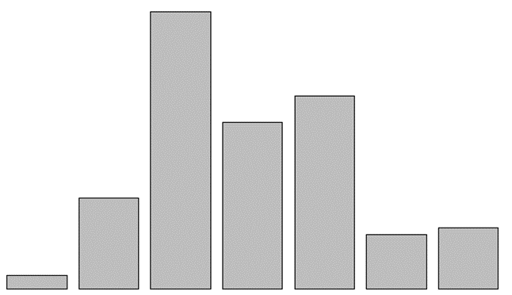

------------------------------------------------------------------------

### 
 **Assignment 2**

**1. Lab01- 02 in R (Download the .qmd files in Teams)
a. Render and upload your files to GitHub website**

**b. Be sure to uploaded associated folders (e.g.
Lab01.html, Lab01_files, Lab02.html, Lab02_files)**

**2. Review Chapters 3 to 7 in R4DS, Section 3.5 in Data programming. Run an exploratory data analysis with R using the TEDS2016 dataset
(sample codes as follows):**

**library**(haven)

TEDS_2016 \<- **read_stata**("https://github.com/datageneration/home/blob/master/DataProgramming/data/TEDS_2016.dta?raw=true")

**3. What problems do you encounter when working with the dataset?**

Approximately 3008 places in the dataset was missing values -- this is one of the first things
I check for.  Also, the data for many of the variables goes from one extreme value to another, likely creating outliers and skewness.

**4. How to deal with missing values?**

I typically deal with this by replacing missing values with the value of \"0\"

**5. (Next step) Explore the relationship between Tondu and other variables including female,
DPP, age, income, edu, Taiwanese and Econ_worse. What methods would you use?**

I would perform a multivariable, linear regression analysis:

Call: lm(formula = Tondu \~ female + DPP + Age + income + edu + Taiwanese + Econ_worse, data = TEDS_2016)

Residuals:

Min      1Q  Median   3Q     Max

-4.1824 -1.1444 -0.2389  0.7952  6.1297

Coefficients:

Estimate Std. Error t value Pr(\>\|t\|)   

(Intercept)  4.48984  0.23703  18.942  \< 2e-16 \*\*\*

female        0.34218     0.08311  4.117 4.03e-05 \*\*\*

DPP           0.10555    0.09210  1.146  0.25194   

Age          -0.02140     0.03604 -0.594   0.55272   

income       -0.02533     0.01597  -1.586  0.11289   

edu          -0.21258     0.03543 -6.000 2.41e-09 \*\*\*

Taiwanese     0.74775  0.09232    8.100 1.05e-15 \*\*\*

Econ_worse  -0.23917   0.08454   -2.829  0.00472 \*\*

Signif. codes:  0 \'\*\*\*\' 0.001 \'\*\*\' 0.01 \'\*\' 0.05 \'.\' 0.1 \' \'1

Residual standard error: 1.682 on 1682 degrees of freedom

Multiple R-squared:  0.1054,  Adjusted R-squared:  0.1016

F-statistic:  28.3 on 7 and 1682 DF,  p-value: \< 2.2e-16

\> vif(TEDS.lm)

 female        DPP        Age    income        edu  Taiwanese Econ_worse

1.030890   1.152199   1.599321  1.140312   1.703449   1.190378   1.054758

\> lmtest::bptest(TEDS.lm)

studentized Breusch-Pagan test

data:  TEDS.lm

BP = 213.6, df = 7, p-value \< 2.2e-16

*\*evidence of severe heteroscedasticity*

**6. (Next step) How about the votetsai variable (vote for DPP candidate Tsai Ing-wen)?**

Call: lm(formula = Tondu \~ votetsai, data = TEDS_2016)

Residuals: Min      1Q  Median       3Q     Max

-3.3785 -1.3785 -0.3785  0.6215   5.0944

Coefficients:

         Estimate Std. Error t value Pr(\>\|t\|)   

(Intercept)  3.90556  0.05864  66.597  \< 2e-16 \*\*\*

votetsai    0.47293  0.08577  5.514 4.06e-08 \*\*\*

Signif. codes:  0 \'\*\*\*\' 0.001 \'\*\*\' 0.01 \'\*\' 0.05 \'.\' 0.1 \' \' 1

Residual standard error: 1.759 on 1688 degrees of freedom

Multiple R-squared:  0.01769, Adjusted R-squared:  0.01711

F-statistic:  30.4 on 1 and 1688 DF,  p-value: 4.06e-08

lmtest::bptest(VotetSai.lm)

       studentized Breusch-Pagan test

data:  VotetSai.lm

BP = 12.159, df = 1, p-value = 0.0004885

*\*evidence of significant heteroscedasticity*

**7. (Next step) Generate frequency table and barchart of the Tondu variable. Assign labels to the variable using the following:**

TEDS_2016\$Tondu\<-as.numeric(TEDS_2016\$Tondu,labels=c("Unification
now\", \"Status quo, unif. in future\", \"Status quo, decide later",
"Status quo forever", "Status quo, indep. in future",
"Independence now\", \"No response"))

 

 
